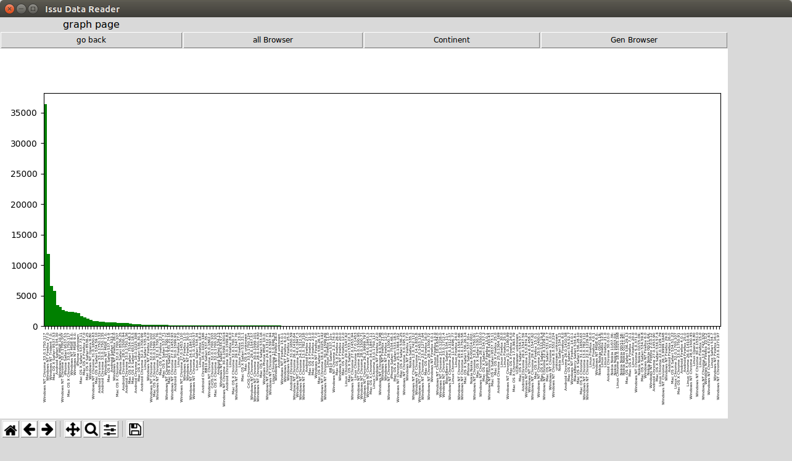
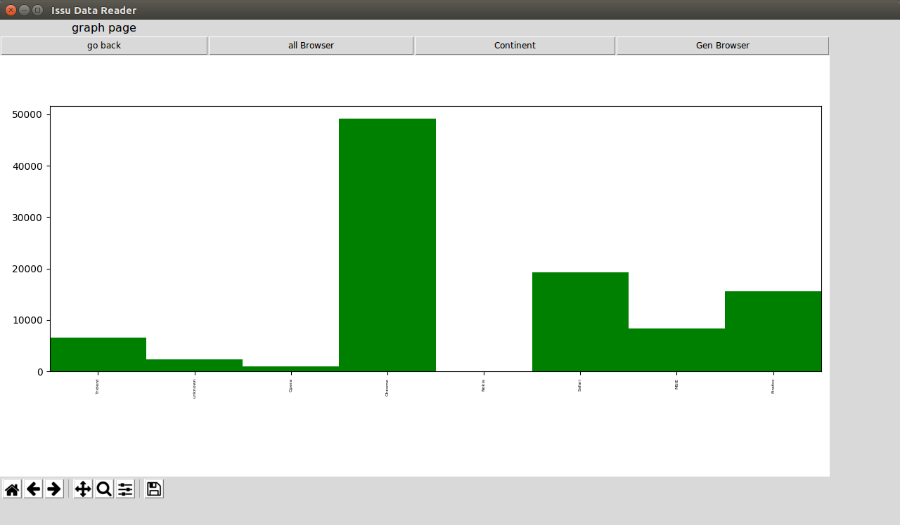
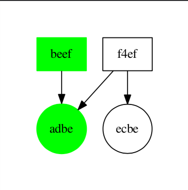

# Python data analyser
## About
This project was part of my industrial programming module. I got a 66% for this coursework and got a 70% mark on the module over all. The aim of the project was to read in a json file and read in user agent strings. From this we had to extrapolate data such as browsers and locations. Using mat plot lib we display some of the data as well as an also-likes graph.

### Technology used
* Python 3
* Matplotlib
* GraphViz
* Json 

## How To Run
make sure python 3 is installed on your computer as well as making sure you have the matplotlib and graphviz libraries installed. Python3-tk may also need to be installed.

once all necessary software has been installed, navigate to the root folder and run this comand.
	
	./GUI -t 3a -d 100806162735-00000000115598650cb8b514246272b5

## MatplotLib Graphs
the two mat plot lib graphs deisplayed bellow were for tracking the browser usage from the user strings. The first image is all browsers seperated by version. The second image is a general view of the browsers.

## GraphViz
We also had to create an also-like sfunctionality, finding which pages users commonnly liked and then displaying these connections in a graph. This graph was for a small set of data.

 